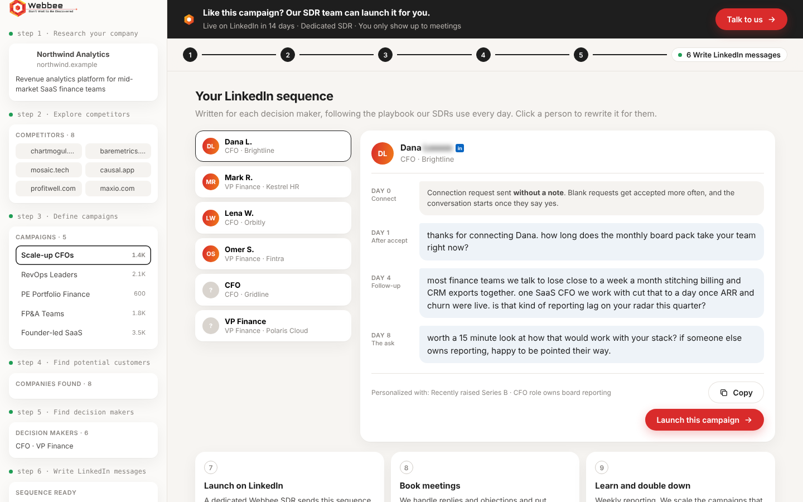

# Webbee Welcome - LinkedIn Pilot Campaign tool

A visitor pastes their website and, in about two minutes, gets a free pilot LinkedIn campaign built by Webbee's research agent. Every step leads to the same call to action: talk to Webbee so our SDR team launches it.

| Step | What happens |
|---|---|
| 1. Research your company | Reads the visitor's website (home + key pages) and builds a company profile |
| 2. Explore competitors | Web search for the alternatives buyers compare |
| 3. Define campaigns | 5 ranked ICP segments with pain, criteria, titles and fit score |
| 4. Find potential customers | Real companies matching the chosen segment, found via web search |
| 5. Find decision makers | People verified against public LinkedIn search results. Surnames are masked and profile links stay on the server; unverified rows show the role only |
| 6. Write LinkedIn messages | Blank connection request + 3-message sequence following Webbee's LinkedIn playbook |



## Files
- `index.html` - landing page. The website field opens `explore.html?site=<domain>`
- `explore.html`, `assets/explore.js`, `assets/explore.css` - the 6-step flow and the "Talk to us" form
- `api/research.js` - one endpoint, one step per call (Vercel serverless function)
- `api/lead.js` - forwards "Talk to us" submissions (and anonymous "URL submitted" events) to a webhook
- `lib/steps.js` - prompts, output schemas and verification for each step
- `lib/claude.js` - Claude API call with web search and a strict `submit` tool for structured output
- `lib/site.js` - safe website fetcher (public hosts only)
- `lib/mock.js` - fictional demo data for `MOCK=1`

## Run locally
```bash
npm install
npm run dev:mock                          # demo data, no API key needed
ANTHROPIC_API_KEY=sk-ant-... npm run dev  # real research
```
Open http://localhost:3000

## Deploy (Vercel)
1. Import the repo in Vercel (no build step needed).
2. Set environment variables:
   - `ANTHROPIC_API_KEY` (required)
   - `LEAD_WEBHOOK_URL` - Make / Zapier / HubSpot / Slack webhook that receives leads (without it, leads are only logged)
   - `RUNS_PER_IP_PER_HOUR` - optional, default 5
   - `CLAUDE_MODEL` - optional, default `claude-opus-5-5`
3. Set `bookingUrl` in `assets/explore.js` and in the `CONFIG` block of `index.html`.

## Cost and abuse
A full run makes about 6 Claude calls, 4 of them with web search. Results are cached per domain for 24 hours and runs are rate limited per IP, both in function memory. For high traffic, move them to a shared store (Vercel KV / Upstash) and add a CAPTCHA such as Cloudflare Turnstile on the landing form.

## Before going live
- Replace the placeholder content in `index.html` marked `data-edit` (stats, client results, testimonials) and the plan prices in `CONFIG`.
- Review the interstitial copy in `assets/explore.js` (`CONFIG.interstitials`) so every claim is accurate.
